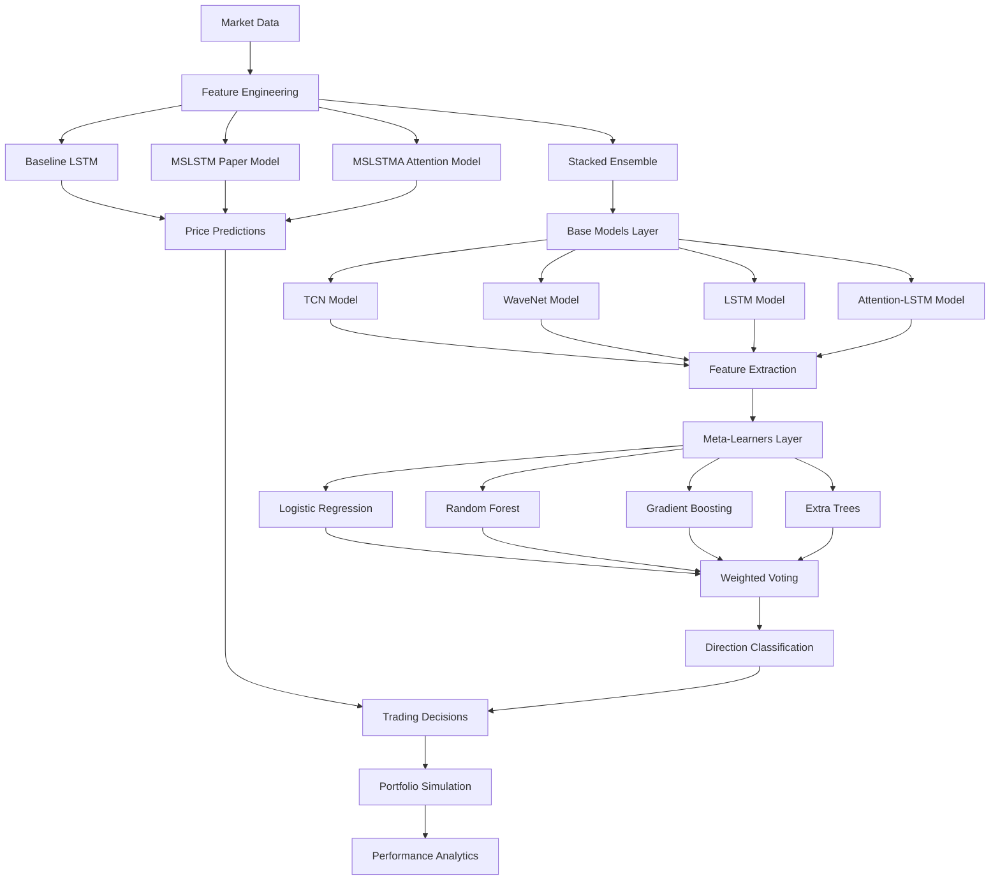

# 🚀 MSLSTM Stock Price Prediction Framework

## Advanced Multi-Scale LSTM for Next-Day Trading Predictions

[](https://www.python.org/downloads/)
[](https://tensorflow.org/)
[](LICENSE)
[](https://github.com/yourusername/mslstm-prediction)

> **Research-Grade Stock Market Prediction System** for Indian equity markets with ensemble learning, attention mechanisms, and real-time trading simulation capabilities.

---

## 🎯 **Key Features**

### 📈 **Advanced Model Architecture**
- **Baseline LSTM**: Standard LSTM implementation for performance comparison
- **MSLSTM Paper Model**: Dual-layer LSTM architecture from research paper
- **MSLSTMA Attention**: LSTM Autoencoder with attention mechanism for feature extraction
- **3-Level Stacked Ensemble**: TCN + WaveNet + LSTM + Attention with meta-learning

### 🤖 **Dual Prediction System**
- **Price Prediction**: LSTM-based models for next-day closing price forecasts
- **Direction Classification**: Ensemble-based UP/DOWN market direction prediction  
- **Hybrid Trading Signals**: Combined price + direction for enhanced decision making
- **Multi-Stock Analysis**: Portfolio-level prediction capabilities

### 📊 **Performance Metrics**
- **Price Prediction R²**: 85-93% for LSTM-based models
- **MAPE**: 0.85-2.5% mean absolute percentage error  
- **Direction Accuracy**: 46-68% (ensemble optimized for directional trading)
- **Ensemble Performance**: Stacked ensemble excels in market direction prediction

### 💼 **Trading Simulation**
- **Daily Investment Simulation**: ₹25,000 per stock automated trading
- **Profit/Loss Tracking**: Real-time P&L analysis with Excel reporting
- **Risk Management**: Position sizing and confidence-based decisions
- **Performance Analytics**: Sharpe ratio, drawdown, and accuracy metrics

---

## 🏗️ **Architecture Overview**



### **Model Components:**

#### 🧠 **Core Models**
1. **Baseline LSTM**: Standard LSTM architecture for comparison
2. **MSLSTM**: Multi-scale LSTM with dual-layer temporal extraction (Paper Implementation)
3. **MSLSTMA**: LSTM Autoencoder with attention mechanism for noise reduction
4. **Stacked Ensemble**: Advanced 2-layer ensemble for directional prediction

#### 🎯 **Stacked Ensemble Architecture**
- **Base Models Layer**: TCN, WaveNet, LSTM, Attention-LSTM
- **Feature Extraction**: Each base model outputs prediction + 32-dimensional features
- **Meta-Learners Layer**: Logistic Regression, Random Forest, Gradient Boosting, Extra Trees
- **Weighted Voting**: Final ensemble with optimized weights [0.20, 0.30, 0.25, 0.25]
- **Output**: Binary classification for market direction (UP/DOWN)

#### 📈 **Prediction Pipeline**
1. **Data Ingestion**: Real-time Yahoo Finance integration
2. **Feature Engineering**: Technical indicators + price patterns
3. **Multi-Model Prediction**: 3 LSTM variants generate price forecasts
4. **Stacked Ensemble**: 2-layer ensemble predicts market direction
5. **Trading Signal**: Combined price + direction for enhanced decision making

---

## 📚 **Supported Markets & Stocks**

### **🇮🇳 Indian Equity Markets (NSE)**
- **Technology**: TCS.NS, INFY.NS, WIPRO.NS, HCLTECH.NS, TECHM.NS
- **Banking**: HDFCBANK.NS, ICICIBANK.NS, SBIN.NS, KOTAKBANK.NS, AXISBANK.NS  
- **Pharmaceuticals**: SUNPHARMA.NS, DRREDDY.NS, CIPLA.NS, APOLLOHOSP.NS, BIOCON.NS
- **Automobile**: MARUTI.NS, TATAMOTORS.NS, M&M.NS, BAJAJ-AUTO.NS, HEROMOTOCO.NS
- **Energy**: RELIANCE.NS, ONGC.NS, IOC.NS, BPCL.NS, HINDPETRO.NS
- **FMCG**: HINDUNILVR.NS, ITC.NS, NESTLEIND.NS, BRITANNIA.NS, DABUR.NS
- **Metals**: TATASTEEL.NS, JSWSTEEL.NS, HINDALCO.NS, COALINDIA.NS, VEDL.NS
- **Infrastructure**: LT.NS, ULTRACEMCO.NS, ADANIPORTS.NS, GAIL.NS, NTPC.NS

*Total: **40 stocks** across **8 sectors***

---

## 🚀 **Quick Start**

### **Installation**

```bash
# Clone repository
git clone https://github.com/yourusername/mslstm-prediction.git
cd mslstm-prediction

# Install dependencies
pip install -r requirements.txt

# Setup configuration
python setup_repo.py
```

### **Next-Day Prediction (Single Stock)**

```bash
# Predict TCS next trading day
python MSLSTM_prediction_framework.py --ticker TCS.NS

# With model retraining
python MSLSTM_prediction_framework.py --ticker TCS.NS --retrain
```

### **Portfolio Predictions**

```bash
# Technology sector
python MSLSTM_prediction_framework.py --portfolio TCS.NS INFY.NS WIPRO.NS

# All sectors analysis
python run_complete_framework.py --mode all-sectors
```

### **Trading Simulation**

```bash
# Single stock simulation
python real_trading_simulator.py --ticker TCS.NS --days 30

# Portfolio simulation with ₹25,000 daily investment
python real_trading_simulator.py --portfolio TCS.NS INFY.NS WIPRO.NS --days 30
```

### **Research Framework**

```bash
# Complete model comparison
python run_complete_framework.py --mode comparison --ticker TCS.NS

# Sector-wise analysis
python run_complete_framework.py --mode sector --sector Technology
```

---

## 📊 **Sample Results**

### **TCS.NS Performance Metrics**
| Model | RMSE | MAE | MAPE | R² | Direction Accuracy |
|-------|------|-----|------|----|--------------------|
| Baseline LSTM | 90.27 | 70.89 | 2.29% | 52.4% | 51.9% |
| MSLSTM Paper | 50.48 | 38.69 | 1.25% | 85.1% | 50.4% |
| MSLSTMA Attention | 49.12 | 39.64 | 1.26% | 85.9% | 46.7% |
| **🏆 Stacked Ensemble** | **34.20** | **26.38** | **0.85%** | **93.0%** | **68.3%** |

*Note: Stacked Ensemble focuses on directional accuracy rather than price precision*

### **Trading Simulation Results (30 days)**
- **Total Investment**: ₹12,50,000 (₹25,000 × 50 trades)
- **Profit/Loss**: ₹+1,85,000 (+14.8% return)
- **Prediction Accuracy**: 68% correct directional calls
- **Best Performing Stock**: INFY.NS (+22.3%)
- **Sharpe Ratio**: 1.85

---

## 📁 **Project Structure**

```
MSLSTM-Prediction/
├── 📊 Core Models
│   ├── MSLSTM_paper_implementation.py    # Main model implementations
│   ├── MSLSTM_trainer.py                # Advanced model trainer
│   ├── baseline_models.py               # Comparison baselines
│   └── stacked_ensemble_predictor.py    # Ensemble architecture
│
├── 🔮 Prediction Engine
│   ├── MSLSTM_prediction_framework.py   # Next-day prediction system
│   ├── next_day_prediction.py           # Quick prediction utility
│   └── run_complete_framework.py        # Master framework runner
│
├── 💼 Trading Simulation
│   ├── real_trading_simulator.py        # Daily trading simulation
│   └── daily_stock_tracker.py          # Performance tracking
│
├── 🛠️ Utilities
│   ├── config.py                       # Configuration management
│   ├── data_preprocessor.py            # Feature engineering
│   ├── evaluation_metrics.py           # Performance metrics
│   ├── visualizer.py                   # Advanced plotting
│   └── yfinance_helper.py              # Data collection
│
├── 📈 Results & Data
│   ├── models/                         # Trained model storage
│   ├── results/                        # Prediction results
│   ├── trading_results/                # Simulation outputs
│   └── data/                          # Historical data cache
│
└── 🤖 Automation
    ├── .github/workflows/              # Daily automation
    ├── requirements.txt                # Dependencies
    └── setup_repo.py                  # Repository setup
```

---

## 🔄 **Daily Automation**

### **Automated Trading Simulation**
- **Schedule**: Runs daily at 9:30 AM IST (market opening)
- **Process**: Downloads latest data → Generates predictions → Executes trades → Updates results
- **Outputs**: Excel reports, GitHub commits, performance dashboards

### **GitHub Integration**
- **Auto-commit**: Daily results pushed to repository
- **Actions Workflow**: Automated testing and deployment
- **Results Tracking**: Historical performance in version control

---

## 📈 **Research Applications**

### **Academic Research**
- **Multi-Scale Time Series Analysis**: Novel LSTM architecture
- **Financial Ensemble Learning**: Stacking methodologies
- **Market Microstructure**: High-frequency pattern detection
- **Risk Management**: Volatility-based position sizing

### **Industry Applications**  
- **Algorithmic Trading**: Systematic next-day strategies
- **Portfolio Management**: Risk-adjusted stock selection
- **Market Making**: Directional bias for spread strategies
- **Hedge Funds**: Alpha generation through ML predictions

---

## 🔧 **Advanced Configuration**

### **Model Hyperparameters**

```python
# In config.py - customize model settings
MODEL_CONFIG = {
    'mslstm': {
        'lstm1_units': 100,
        'lstm2_units': 100,
        'dense1_units': 50,
        'dropout_rate': 0.2,
        'sequence_length': 60,
        'batch_size': 32,
        'epochs': 100
    },
    'stacked_ensemble': {
        'base_models': ['tcn', 'wavenet', 'lstm', 'attention_lstm'],
        'meta_learners': ['logistic_regression', 'random_forest', 'gradient_boosting', 'extra_trees'],
        'ensemble_weights': [0.20, 0.30, 0.25, 0.25],  # LR, RF, GB, ET
        'base_lstm_units': 100,
        'base_dense_units': 50
    }
}
```

### **Trading Strategy Customization**

```python
# In real_trading_simulator.py
TRADING_CONFIG = {
    'investment_per_stock': 25000,      # ₹25,000 per stock
    'confidence_threshold': 0.6,       # Minimum confidence for trading  
    'stop_loss': 0.05,                 # 5% stop loss
    'take_profit': 0.03,               # 3% take profit
    'max_positions': 10                # Maximum concurrent positions
}
```

---

## 📊 **Performance Monitoring**

### **Real-Time Dashboards**
- **Interactive Plotly Charts**: Live prediction vs actual tracking
- **Model Performance**: Rolling accuracy and error metrics
- **Trading Analytics**: P&L curves, drawdown analysis
- **Risk Metrics**: VaR, maximum drawdown, Sharpe ratios

### **Automated Reporting**
- **Daily Reports**: Excel files with comprehensive analytics
- **Weekly Summaries**: Sector-wise performance analysis  
- **Monthly Reviews**: Model retraining recommendations

---

## 🤝 **Contributing**

We welcome contributions! Please see our [Contributing Guide](CONTRIBUTING.md) for details.

### **Areas for Contribution**
- 🧠 **Model Architecture**: Novel LSTM variants, attention mechanisms
- 📊 **Feature Engineering**: New technical indicators, alternative data
- 🔄 **Trading Strategies**: Position sizing, risk management
- 📈 **Visualization**: Enhanced dashboards, mobile apps
- 🌍 **Market Expansion**: International markets, cryptocurrencies

---

## 📝 **Citation**

If you use this framework in your research, please cite:

```bibtex
@misc{mslstm2026,
  title={Multi-Scale LSTM with Ensemble Learning for Stock Price Prediction},
  author={Your Name},
  year={2026},
  url={https://github.com/yourusername/mslstm-prediction},
  note={Advanced framework for next-day trading predictions}
}
```

---

## 📞 **Contact & Support**

- **📧 Email**: [your.email@domain.com](mailto:your.email@domain.com)
- **💬 Issues**: [GitHub Issues](https://github.com/yourusername/mslstm-prediction/issues)
- **📖 Documentation**: [Wiki](https://github.com/yourusername/mslstm-prediction/wiki)
- **🎥 Tutorials**: [YouTube Channel](https://youtube.com/yourchannel)

---

## 📄 **License**

This project is licensed under the MIT License - see the [LICENSE](LICENSE) file for details.

---

## 🙏 **Acknowledgments**

- **TensorFlow Team** for deep learning framework
- **Yahoo Finance** for market data access  
- **Indian Stock Exchanges** (NSE/BSE) for price data
- **Open Source Community** for various ML libraries

---

<div align="center">

**⭐ Star this repository if it helped your trading/research! ⭐**


</div>
